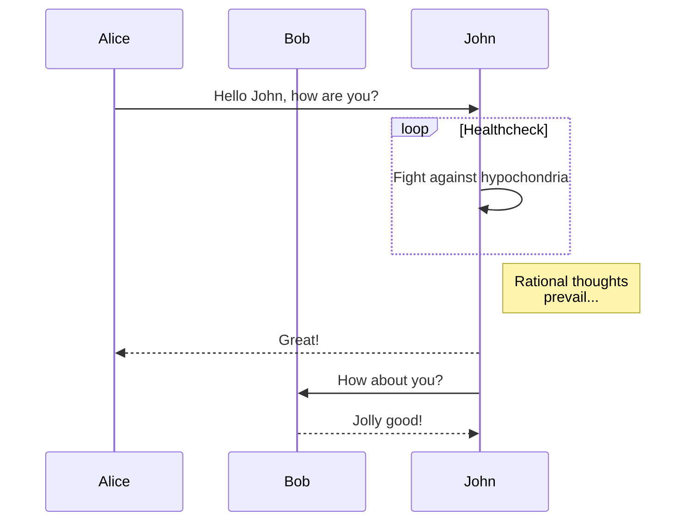
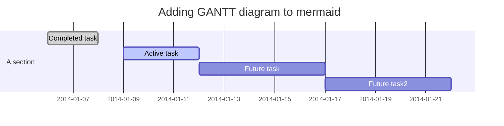

+++
title = "hexo mermaid"
date = 2017-12-04
category = "Mermaid"

[taxonomies]
tags = ["mermaid"]
+++

### mermaid

#### flowchart


#### sequence



#### gantt



#### git graph


### code
```shell
echo "HelloWorld"
```

```python
@requires_authorization
def somefunc(param1='', param2=0):
    r'''A docstring'''
    # interesting
    if param1 > param2: 
        print 'Gre\'ater'
    return (param2 - param1 + 1) or None

class SomeClass:
    pass
```

### Latex

$$ 1 + 1 = ? $$
